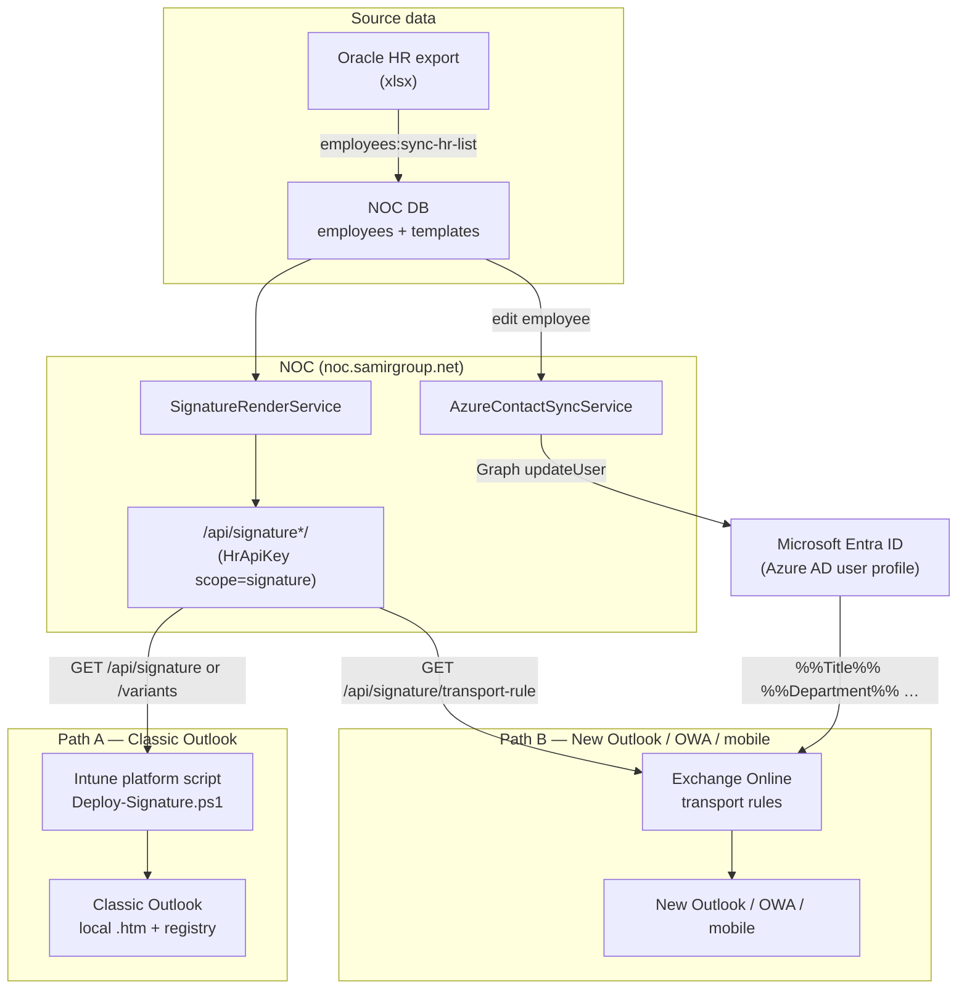
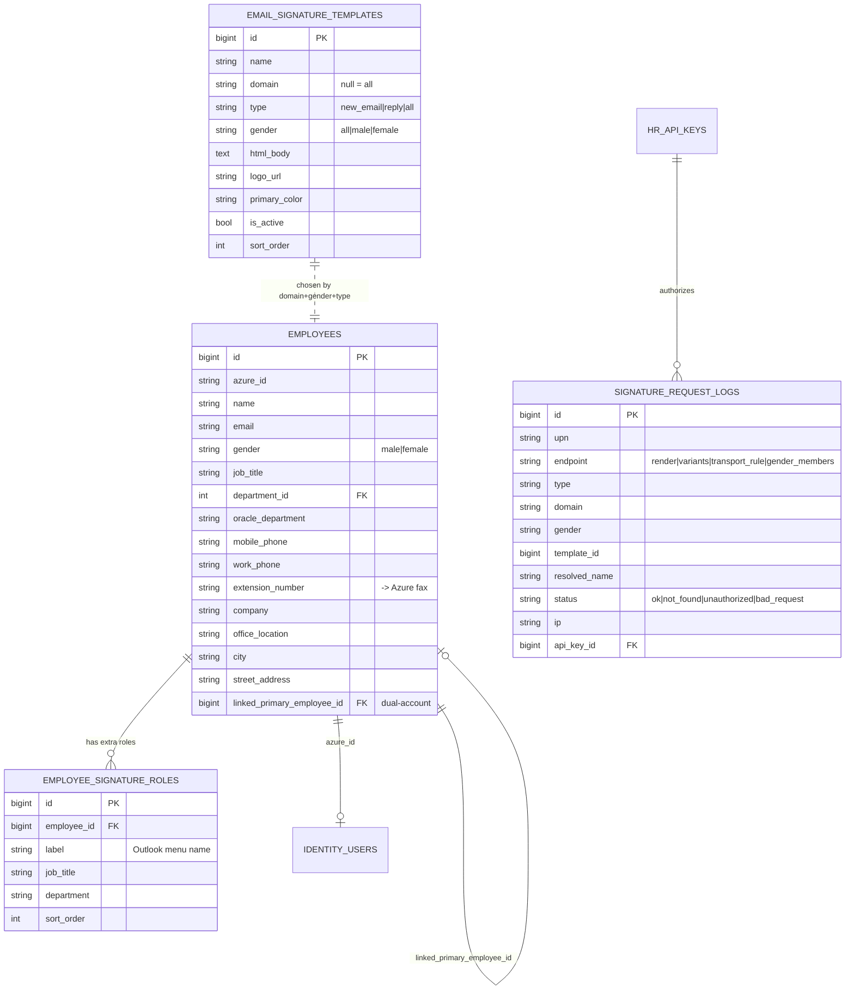
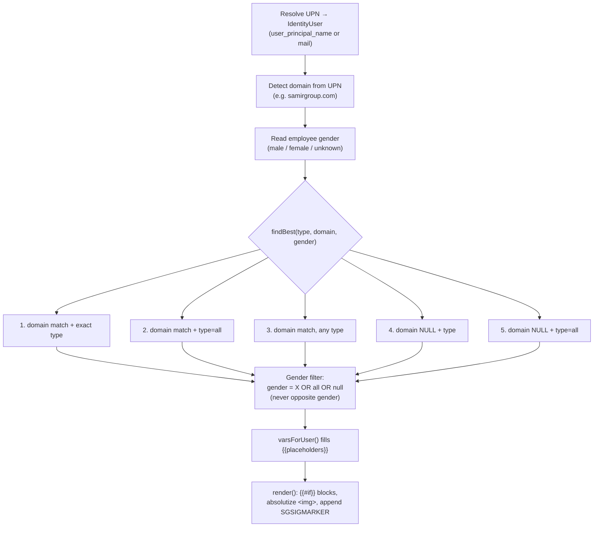
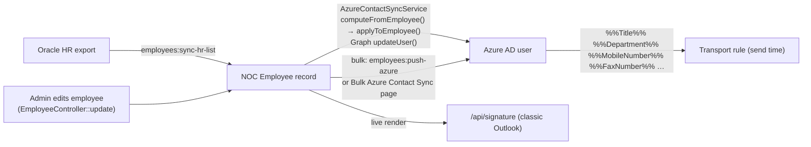
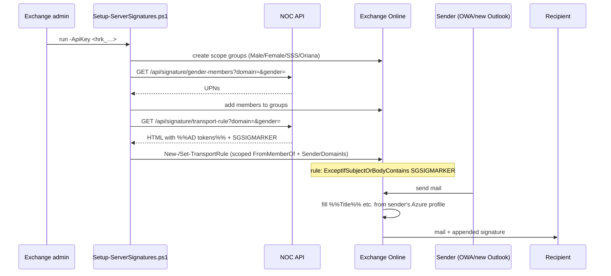
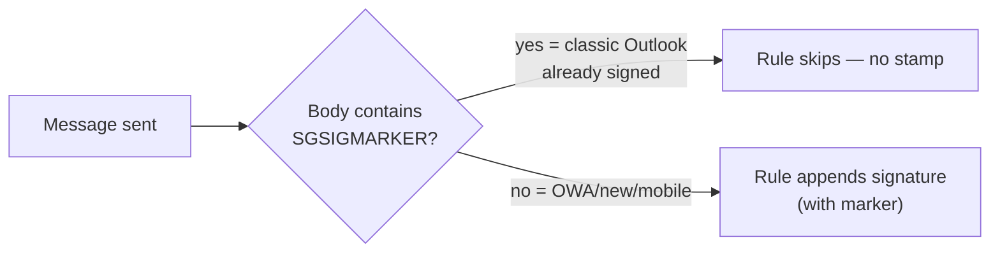
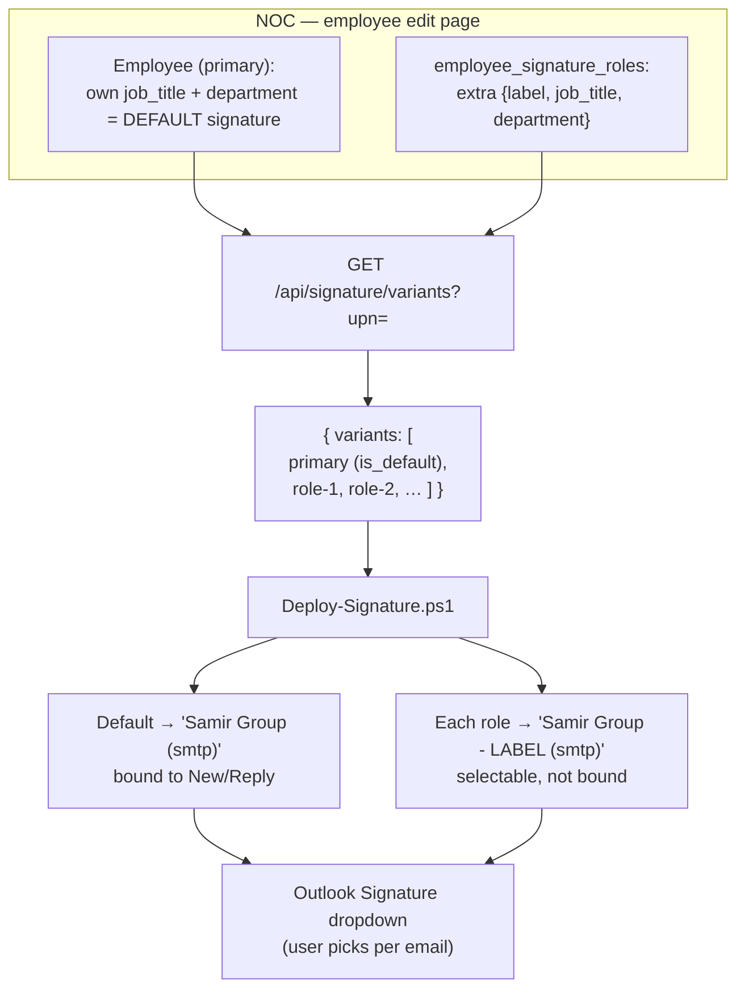

# Email Signature System

Centralized, NOC-driven email signatures for Samir Group / SSS / Oriana. NOC is the
single source of truth; signatures are **pulled/served**, never hand-edited on the client.

- **Admin UI:** `/admin/signatures` (templates), plus Commands, Transport Preview, Request Log, and per-employee **Signature roles** on the employee edit page.
- **API:** `/api/signature*` (key-gated).
- **Clients:** classic Outlook (Intune PowerShell) + New Outlook / OWA / mobile (Exchange transport rules).
- **Code:** `app/Services/Signature/SignatureRenderService.php`, `app/Http/Controllers/Admin/SignatureController.php`, `deployment/signature/*`.

---

## Table of contents

1. [Core principles](#1-core-principles)
2. [High-level architecture](#2-high-level-architecture)
3. [Data model](#3-data-model)
4. [How a signature is chosen (template selection)](#4-how-a-signature-is-chosen-template-selection)
5. [Where the data comes from (NOC → Azure)](#5-where-the-data-comes-from-noc--azure)
6. [Delivery path A — classic Outlook (client script)](#6-delivery-path-a--classic-outlook-client-script)
7. [Delivery path B — New Outlook / OWA / mobile (transport rules)](#7-delivery-path-b--new-outlook--owa--mobile-transport-rules)
8. [Dedup marker (no double-signing)](#8-dedup-marker-no-double-signing)
9. [Multi-role signatures (two roles, one mailbox)](#9-multi-role-signatures-two-roles-one-mailbox)
10. [Linked (dual) accounts](#10-linked-dual-accounts)
11. [Admin pages & API reference](#11-admin-pages--api-reference)
12. [Deployment scripts reference](#12-deployment-scripts-reference)
13. [Operations runbook](#13-operations-runbook)
14. [Gotchas & troubleshooting](#14-gotchas--troubleshooting)

---

## 1. Core principles

| Principle | Detail |
|---|---|
| **NOC is source of truth** | Signature HTML (templates) + per-person data (Employee record) live in NOC. |
| **Two delivery paths** | Classic Outlook renders **live** from NOC; New Outlook/OWA/mobile are stamped **server-side** by Exchange. |
| **One design, filled per user** | A template is an HTML shell with `{{placeholders}}`; personal fields (name, title, dept, phone…) are injected at send/render time. |
| **No double-signing** | Every rendered signature carries a hidden marker (`SGSIGMARKER`); the transport rule skips any message that already contains it. |
| **Key-gated** | All `/api/signature*` calls require an `HrApiKey` with scope `signature` (`hrk_…`). |

---

## 2. High-level architecture



**Why two paths?** Classic Outlook has no Graph API to set the desktop signature, so a client
script writes local files. New Outlook / OWA / mobile ignore local files and use cloud/roaming
signatures with no writable API — so those are stamped by an Exchange **transport rule**, which
can only read the sender's **single** Azure `Title`/`Department`. That single-value limit is why
some features (multi-role) are classic-Outlook-only.

---

## 3. Data model



Key columns:

- **`email_signature_templates`** — pure HTML shell + discriminators (`domain`, `type`, `gender`). No per-user data.
- **`employees`** — the per-person data source. Contact fields are editable in NOC and auto-pushed to Azure. `extension_number` is carried in Azure's **fax** field (read by the transport rule as `%%FaxNumber%%`).
- **`employee_signature_roles`** — *extra* signatures (title/department only) for a multi-role person. The employee's own title/department is always the default. See [§9](#9-multi-role-signatures-two-roles-one-mailbox).
- **`linked_primary_employee_id`** — a secondary mailbox inherits HR fields from a primary employee. See [§10](#10-linked-dual-accounts).
- **`signature_request_logs`** — every API call (who/what/served), shown at Admin → Signatures → Request Log.

---

## 4. How a signature is chosen (template selection)

`EmailSignatureTemplate::findBest($type, $domain, $gender)` picks one active template by priority.
Domain always beats a cross-domain fallback; gender never selects the opposite gender.



- **Gender:** templates and employees each carry a `gender`. When gender is known the opposite-gender template is excluded; when unknown (e.g. server transport render) no gender filter is applied so **domain still wins** (prevents cross-domain fallback). Tiebreak order: exact gender > `all` > opposite; unknown defaults to `male`.
- **`{{#if var}}…{{/if}}`** blocks are dropped when the variable is empty (no blank lines).

---

## 5. Where the data comes from (NOC → Azure)

Classic Outlook reads live NOC data, but the transport rule reads **Azure AD attributes**. So NOC
must keep Azure in sync, otherwise New Outlook/OWA shows stale titles.



Field mapping (NOC → Azure → transport token):

| NOC employee field | Azure attribute | Transport token |
|---|---|---|
| `name` | `displayName` | `%%DisplayName%%` |
| `job_title` | `jobTitle` | `%%Title%%` |
| department | `department` | `%%Department%%` |
| `mobile_phone` | `mobilePhone` | `%%MobileNumber%%` |
| `work_phone` / branch | `businessPhones[0]` | `%%PhoneNumber%%` |
| `extension_number` | `faxNumber` | `%%FaxNumber%%` |
| `office_location` | `officeLocation` | `%%Office%%` |
| `city` | `city` | `%%City%%` |
| `street_address` | `streetAddress` | `%%StreetAddress%%` |

Notes:
- Saving an employee auto-pushes these to Azure (needs Graph `User.ReadWrite.All`).
- **Mobile** is normalized to KSA form `+966 5X XXX XXXX`; a blank mobile is pushed as `-` so a cleared value actually clears in Azure (Graph never removes an omitted key). Non-Saudi numbers (e.g. `+20…`) are left untouched.
- Bulk review/apply lives at **Identity → Bulk Azure Contact Sync** (filter by domain).

---

## 6. Delivery path A — classic Outlook (client script)

`deployment/signature/Deploy-Signature.ps1`, run by Intune in the **user context** (also runnable by hand from the Commands page).

```mermaid
sequenceDiagram
    participant T as Intune / user
    participant PS as Deploy-Signature.ps1
    participant API as NOC /api/signature*
    participant FS as %APPDATA%\Microsoft\Signatures
    participant REG as HKCU registry
    participant OL as Classic Outlook

    T->>PS: run (TLS 1.2 + ExecutionPolicy Bypass)
    PS->>PS: Get-OutlookAccounts (by SMTP)
    loop each managed account
        PS->>API: GET /api/signature/variants?upn=<smtp>
        alt new NOC (variants)
            API-->>PS: primary + extra roles {new_html, reply_html}
        else old NOC (404)
            PS->>API: GET /api/signature?type=new_email & =reply
            API-->>PS: single HTML (fallback)
        end
        PS->>FS: write <Name>.htm + .txt (read-only)
        PS->>REG: New Signature / Reply-Forward Signature = default
    end
    PS->>REG: clear global default; force roaming off
    PS->>REG: lock (disable Signature button) — see §9
    PS->>T: register SG-Signature-Refresh task (daily 9am + logon [+ hourly if multi-role])
    OL->>FS: reads signatures on next launch
```

**Mechanics:**
- **Accounts** are enumerated by mailbox SMTP under `…\Outlook\Profiles\<profile>\9375CFF0413111d3B88A00104B2A6676\<account>`.
- **Files:** `<Name>.htm` + `<Name>.txt` (UTF-8, no BOM) in `%APPDATA%\Microsoft\Signatures`, written **read-only** so users can't edit them.
- **Registry:** each account gets `New Signature` + `Reply-Forward Signature` = the signature **name**. A global `Common\MailSettings\NewSignature` is **cleared** when per-account is set (else it overrides all accounts).
- **Lock (default):** read-only files + a disabled compose **Signature** button (`DisabledCmdBarItemsList` TCID1=`5608`) + a daily refresh task. Roaming/cloud signatures are forced off (`DisableRoamingSignaturesTemporaryToggle=1`) so local files win.
- **Refresh task `SG-Signature-Refresh`:** re-runs the script daily 9am + at logon (+ hourly for multi-role machines), so template/data edits flow out and manual edits are reverted — no Proactive Remediations needed.
- **Uninstall:** `-RemoveClientSignature` deletes managed files, clears the registry, removes the lock + task.
- Served in one line via `GET /signature/deploy.ps1?api_key=…` (BOM-prefixed for PS 5.1).

---

## 7. Delivery path B — New Outlook / OWA / mobile (transport rules)

`deployment/signature/Setup-ServerSignatures.ps1` (one-shot: groups + membership + rules).
Run by an Exchange admin.



**Mechanics:**
- One rule **per (domain, gender)**, each scoped to a mail-enabled security group whose membership *is* the audience (`SG-Signature-Male`, `SG-Signature-Female`, `SG-Signature-SSS`, `SG-Signature-Oriana`). A rule can't read gender per message, hence group scoping.
- `renderForTransportRule()` maps NOC `{{vars}}` → Exchange `%%AD-attribute%%` tokens, flattens `{{#if}}`, strips Word/editor cruft, and appends `SGSIGMARKER`.
- **Size limit:** the disclaimer must stay well under the Exchange limit (~5 KB practical). A base64-embedded logo blows past it — logos must be **hosted URLs** (`signatures:host-logos` extracts embedded images to `public/images/signatures/…`). Preview sizes at Admin → Signatures → **Transport Preview**.
- Switches: `-RefreshOnly` (re-push rule HTML after a template edit), `-PopulateOnly` (sync group members only), `-Pilot` (create rules but hand-add testers), `-WhatIf`.

---

## 8. Dedup marker (no double-signing)

A user on **classic Outlook** already carries the client signature in the body. If the transport
rule also stamped them, they'd get two. Every render appends a hidden marker; the rule skips any
message that already contains it.



- Constant: `SignatureRenderService::SIG_MARKER = 'SGSIGMARKER'`, emitted as a hidden `<span>` on the **classic-Outlook client render only** (`render()`).
- The **transport-rule output deliberately omits the marker** (`renderForTransportRule()` does not append it). If it stamped the marker, every **reply** that quotes an already-stamped message would contain it, and the rule's exception would skip the reply — replies on New Outlook / OWA / mobile would be unsigned. Omitting it means replies get signed while classic-Outlook mail (whose client signature carries the marker) is still de-duped.
- Transport rule condition: `ExceptIfSubjectOrBodyContainsWords 'SGSIGMARKER'`.
- Residual edge: a New-Outlook/OWA reply that quotes a **classic-Outlook** sender's signature (which has the marker) is still skipped. Fully solving that needs header-based dedup, which classic Outlook can't set — accepted.

---

## 9. Multi-role signatures (two roles, one mailbox)

For a person who holds **two roles under one mailbox** and needs two signatures differing only in
**job title + department**, selectable in classic Outlook. **Classic Outlook only** — New
Outlook/OWA/mobile always show the primary role (the transport rule reads one Azure title).



**Rules:**
- Only *extra* roles are stored; the employee's own title/department stays the default. A role must set a **job title and/or department** (the **label** is only the Outlook menu name and does not appear in the signature) — a role with neither is rejected.
- Managed on the **employee edit page** → *Signature roles* card: each row has its own **Save** and **Remove** (independent of the profile save); Department is a dropdown; there's an **Add** row. Endpoints: `POST/PUT/DELETE /admin/employees/{employee}/signature-roles[/{role}]`.
- API `resolveAndRender(..., $override)` swaps only title/department for a role; everything else stays the primary.
- **Lock relaxation:** on a machine that has a multi-role account the client **leaves the Signature dropdown enabled** (so the user can pick) but keeps files read-only and adds an **hourly** refresh so manual edits are reverted. Single-role machines stay fully locked (dropdown disabled). Gated on `$anyMultiVariant`.
- Backward compatible: an old NOC without `/variants` returns 404 → the client falls back to the single `/api/signature` flow.

---

## 10. Linked (dual) accounts

Some people have **two mailboxes** (e.g. a SamirGroup account *and* an SSS account) but one HR
record. The secondary account inherits HR fields from the primary and is fixed to a branch (JED).

```mermaid
flowchart LR
    SSS["Primary employee (SSS)<br/>job_title, department,<br/>extension, mobile"] -->|linked_primary_employee_id| SG["Secondary account (SamirGroup)"]
    SG -->|hrSource() → primary| SIG["Signature + Azure contact for SamirGroup<br/>= SSS data, branch = JED,<br/>name/email/company = own"]
```

- Managed at **Identity → Linked Accounts**. `Employee::hrSource()` returns the linked primary for title/department/extension/mobile; branch, name, email, and company stay the account's own.
- Distinct from multi-role: linked accounts = **two mailboxes → one HR record**; multi-role = **one mailbox → two titles**.

---

## 11. Admin pages & API reference

### Admin pages (gated by `permission:manage-signatures`, employee pages by `manage-employees`)

| Page | Route | Purpose |
|---|---|---|
| Signatures (templates) | `/admin/signatures` | CRUD templates (TinyMCE visual + HTML + plain-text), per domain/gender/type; duplicate/activate. |
| Commands | `/admin/signatures/commands` | Copy-run PowerShell: update server rules, add/sync users, test, force-apply on a device. |
| Transport Preview | `/admin/signatures/transport-preview` | Shows exactly what each transport rule stamps + its size (catches oversized rules). |
| Request Log | `/admin/signatures/log` | Every API call: who requested, template served, status. |
| Employee → Signature roles | `/admin/employees/{id}/edit` | Add/save/remove per-mailbox extra roles (§9). |
| Linked Accounts | `/admin/identity/linked-accounts` | Dual-account linking (§10). |
| Bulk Azure Contact Sync | `/admin/identity/contact-sync` | Push NOC contact data → Azure (drives transport tokens). |

### API (key-gated, `HrApiKey` scope `signature`, throttled)

| Endpoint | Returns | Consumed by |
|---|---|---|
| `GET /api/signature?upn=&type=new_email\|reply&format=json&api_key=` | one rendered signature | classic client (fallback), spot checks |
| `GET /api/signature/variants?upn=&api_key=` | `{upn, variants:[{key,label,is_default,new_html,reply_html}]}` | classic client (multi-role) |
| `GET /api/signature/transport-rule?domain=&gender=&type=&format=json&api_key=` | HTML with `%%AD tokens%%` + marker | `Setup-ServerSignatures.ps1` |
| `GET /api/signature/gender-members?domain=&gender=&api_key=` | UPNs for a domain/gender | scope-group population |
| `GET /signature/deploy.ps1?file=deploy\|test\|setup&api_key=` | a PowerShell script (BOM) | one-line device/admin runs |

---

## 12. Deployment scripts reference (`deployment/signature/`)

| Script | Run by | What it does |
|---|---|---|
| **Deploy-Signature.ps1** | Intune (user context) | Classic Outlook: per-account install, lock, refresh task, multi-role variants. **The production client.** |
| **Test-Signature.ps1** | IT, interactively | Clean-slate wipe + reinstall + verify on one PC. **No lock** (diagnostic only). |
| **Setup-ServerSignatures.ps1** | Exchange admin | Transport path all-in-one: create groups + populate + deploy per-(domain,gender) rules. Switches `-RefreshOnly`, `-PopulateOnly`, `-Pilot`, `-WhatIf`. |
| **Deploy-TransportRules.ps1** | Exchange admin | Older focused transport-rule deployer (Setup-ServerSignatures supersedes it). |
| **Deploy-NewOutlook-Signatures.ps1** | (legacy) | Per-mailbox `Set-MailboxMessageConfiguration`; only if roaming is disabled org-wide. Prefer transport rules. |
| **Detect-Signature.ps1** | Intune Proactive Remediation | Hash-check detection (optional). |
| **README.md** | — | Operator quick-start. |

Related artisan commands: `signatures:host-logos` (embed→hosted logos), `signatures:fix-images` (strip Word/VML cruft), `employees:sync-hr-list` (Oracle HR import), `employees:push-azure` (bulk NOC→Azure).

---

## 13. Operations runbook

**Edit a signature design (all users):**
1. Admin → Signatures → edit the template → Save.
2. Classic Outlook picks it up automatically (daily/logon refresh).
3. For New Outlook/OWA: re-push the rules — Commands page → *Update server-side signature* (`Setup-ServerSignatures.ps1 -RefreshOnly`).

**Add a second role for a person:**
1. Employee edit page → *Signature roles* → fill Label + Job title and/or Department (dropdown) → **Save** (the row's own button).
2. Re-run the deploy on their PC (Commands page → *Force-apply on a device*). Two selectable signatures appear.

**Onboard the transport path (first time):** Commands page → *first-time full setup* (`Setup-ServerSignatures.ps1 -ApiKey …`), signed in as an Exchange admin.

**Add / sync users into scope groups:** Commands page → *Add / sync users* (`-PopulateOnly`).

**Force-apply on one device now:** Commands page → *Force-apply on an employee device* (runs `Deploy-Signature.ps1` from NOC in one line).

**Change what appears (title/dept/mobile):** edit the Employee in NOC → it auto-pushes to Azure; classic Outlook updates on next refresh, OWA on next send.

---

## 14. Gotchas & troubleshooting

| Symptom | Cause / fix |
|---|---|
| **Two signatures show identical content** | The extra role has no job title AND no department (label alone doesn't change the body). Set a title and/or department. |
| **"Signature role X needs a job title and/or department"** | Same as above — a role with neither is rejected (it would duplicate the default). |
| **Broken logo in the signature** | The template used a **relative** `` (or a base64/Word image). `render()` absolutizes relative `src`; logos must be hosted URLs (`signatures:host-logos`). |
| **`irm` fails "Could not establish trust relationship"** | PowerShell 5.1 defaults to old TLS. Prefix `[Net.ServicePointManager]::SecurityProtocol = [Net.SecurityProtocolType]::Tls12;` (baked into the Commands-page one-liners). |
| **"running scripts is disabled on this system"** | Execution policy. Prefix `Set-ExecutionPolicy -Scope Process Bypass -Force;` (per-session, no admin; baked into the Commands one-liners). |
| **Em-dash / non-ASCII breaks the script on a device** | PS 5.1 reads no-BOM UTF-8 as ANSI. Keep `.ps1` ASCII; the `/signature/deploy.ps1` endpoint serves a UTF-8 BOM. |
| **Transport rule rejected (too big)** | Base64 logo or Word cruft. Host the logo (`signatures:host-logos`) and re-run; check Transport Preview size. |
| **New mail shows the same signature on every account** | A global `Common\MailSettings\NewSignature` overrides per-account. The client clears it when per-account is set. |
| **Multi-role user can't switch signature** | The Signature dropdown is only enabled on machines with a multi-role account; make sure the role is saved and the device re-ran `Deploy-Signature.ps1` (not the unlocked `Test-Signature.ps1`). |
| **OWA/new Outlook shows the wrong/old title** | Azure is stale. Edit the employee (auto-push) or run Bulk Azure Contact Sync / `employees:push-azure`, then `Setup-ServerSignatures.ps1 -RefreshOnly` if the template changed. |
| **New Outlook won't show a second role** | By design — server rules read one Azure title; multi-role is classic-Outlook only. |
| **Reply is unsigned on New Outlook / OWA / mobile (new mail is fine)** | The transport output used to include `SGSIGMARKER`; a reply quotes the earlier stamped message, so the rule's "except if body contains SGSIGMARKER" skipped it. Fixed by omitting the marker from the transport output (client keeps it). Re-push with `Setup-ServerSignatures.ps1 -RefreshOnly`. Old threads that still contain the old marker roll off as new threads start. |

---

*Source of truth for behavior is the code: `app/Services/Signature/SignatureRenderService.php`,
`app/Http/Controllers/Admin/SignatureController.php`, `app/Http/Controllers/Admin/EmployeeController.php`,
and `deployment/signature/*`. Keep this doc in sync when those change.*
